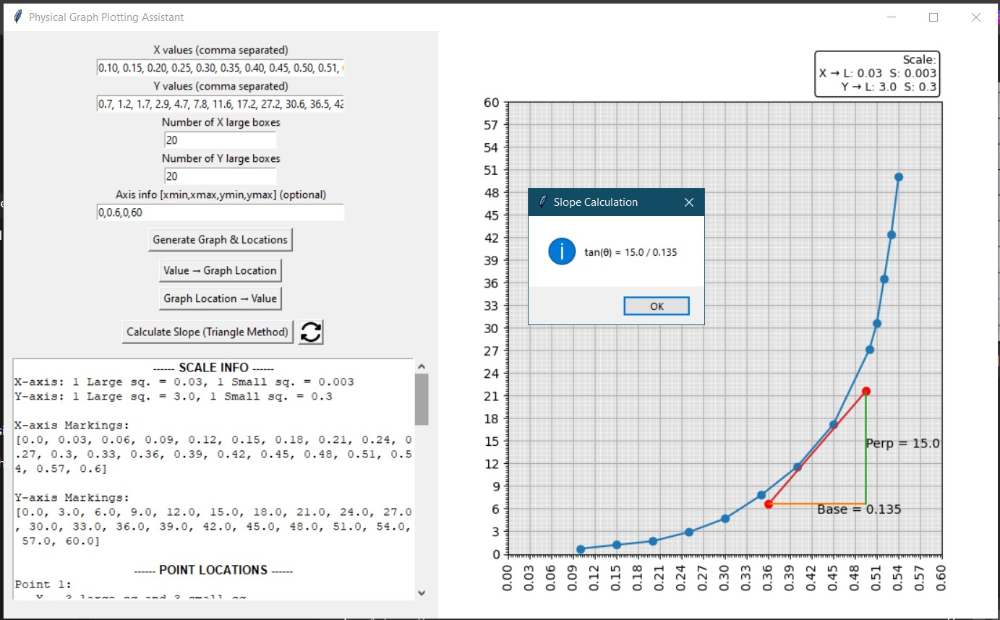

# 📈 Physical Graph Plotting Assistant

A Python-based GUI tool designed to replicate real **physics lab graph plotting workflows**, helping users accurately map experimental data onto physical graph paper.

---

## 🚀 Motivation

During physics lab experiments, plotting irregular datasets on graph paper is often:

- Time-consuming  
- Error-prone  
- Difficult when values don’t align with standard scales  

This tool was built to **automate scale calculation and graph mapping**, while still respecting how physical graphs are actually drawn in laboratory settings.

---

## ✨ Key Features

### 📊 Physical Graph Replication
- Digital graph mimics real graph paper (large & small square divisions)
- Major and minor grids aligned with physical plotting

### ⚙️ Dynamic Grid Modulation
- Adjustable X-grid and Y-grid (number of large boxes)
- Custom axis limits based on available graph sheet
- Scale updates dynamically with user inputs

### 📐 Automatic Scale Calculation
- Computes:
  - Large square value
  - Small division value
- Displays axis markings clearly

### 📍 Value ↔ Graph Mapping
- Convert numerical values into:
  - Large squares
  - Small squares (plotting position)
  
- Convert graph coordinates back into numerical values

### 📏 Slope Calculation (Triangle Method)
- Calculates slope using:
  - Perpendicular (ΔY)
  - Base (ΔX)
- Visualizes triangle directly on graph

### 🧠 Designed for Real Lab Work
- Works with irregular, non-ideal datasets  
- Focuses on **practical usability**, not textbook assumptions  

---

## 🛠 Tech Stack

- Python  
- Tkinter (GUI)  
- Matplotlib (Visualization)  
- NumPy  

---

## 🖥️ Application Preview



---

## ⚡ How to Run

1. Clone the repository:
   ```bash
   git clone https://github.com/yourusername/Physical-Graph-Plotting-Assistant.git
   cd Physical-Graph-Plotting-Assistant

2. Install dependencies:
   ```bash
   pip install -r requirements.txt

3. Run the application:
   ```bash
   python main_GUI.py

---

## 📂 Project Structure
Physical-Graph-Plotting-Assistant\
├── main_GUI.py\
├── requirements.txt\
├── README.md\
├── screenshots\
└── assets

---

## 📈 Use Cases
- Physics laboratory experiments
- Academic graph plotting
- Teaching scale selection & slope methods
- Reducing manual calculation errors

---

## 🔮 Future Improvements
- CSV file input support
- Export graphs as images/PDF
- Error/uncertainty propagation
- Interactive zoom & pan
- Dark mode UI

---

## 🤝 Contributing

Contributions, suggestions, and improvements are welcome!

---

## 📜 License

This project not licensed.

